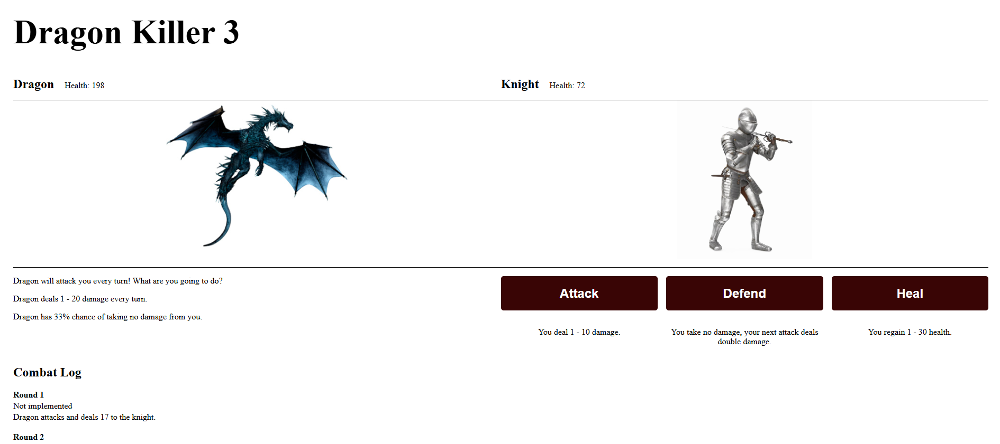

# Dragon Killer 3 Game

A thrilling turn-based combat game built with pure HTML, CSS, and JavaScript — no frameworks, no backend! Battle a fearsome dragon as a valiant knight, strategizing with attacks, defenses, and heals. Features dynamic damage, evasion mechanics, and a live combat log.

### Features

- **Turn-Based Combat**: Choose to attack, defend, or heal each round.
- **Dynamic Damage**:
  - Knight deals 1-10 damage.
  - Dragon deals 1-20 damage per turn.
- **Evasion Mechanic**: Dragon has a 33% chance to dodge attacks.
- **Healing System**: Restore 1-30 health (capped at 100).
- **Live Combat Log**: Track every move with round-by-round updates.
- **Responsive UI**: Clean design with health bars and character sprites.

### Links

- Code URL: (https://github.com/agneja00/Dragon-Knight-Game)
- Live Site URL: (https://dragon-knight-game.vercel.app/)

### Built with

- **HTML5** – Semantic structure.
- **CSS** – Flexbox, animations.
- **JavaScript** – Game logic and DOM manipulation.
- **Vercel** – deployment platform for fast, global hosting and automatic CI/CD integration.

## Author

- Website - [Agnieska Jackevic] (https://web-portfolio-agneja00.vercel.app/)
- Linkedin - [Agnieska Jackevic] (https://www.linkedin.com/in/agnieska-jackevic-948830222/)

